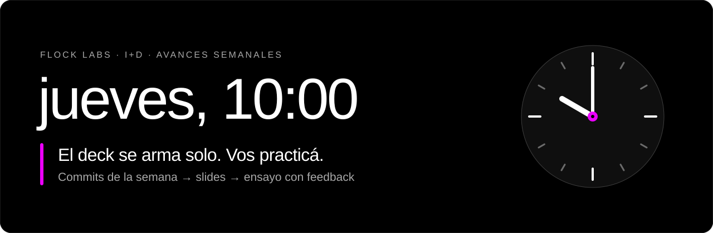

  

# jueves-diez

> Los jueves a las diez se presentan avances. El miércoles a la tarde ya tenés el deck; el resto de la semana, laburá tranquilo.

Skill de Claude Code que prepara la presentación de avances de los jueves 10:00 en Flock Labs I+D. No es una app: todo pasa en el chat de Claude y el deck queda como Artifact en tu claude.ai.

## Cómo funciona

Arranca cuando escribís **"Vamos a preparar las slides semanales"** o sola, con la rutina de los miércoles a las 18:00 (si ese día ya lo corriste, te pasa el link del deck para seguir trabajándolo). Después:

1. **Design system.** `revisar_ds.py` baja de Claude Design el design system y el Template, o los actualiza si cambiaron.
2. **Qué cambió.** `cambios.py` lista commits y archivos tocados en tus proyectos desde el jueves anterior a las 10:00. Claude lo resume y te pregunta qué frentes incluir, para quién es y cuántos minutos tenés.
3. **Deck.** Arma las slides con el design system de Flock, siguiendo el hilo de las semanas anteriores, les pasa [Impeccable](https://impeccable.style/) (crítica, recorte de slides cargadas, tipografía y pulido) y las publica como Artifact.
4. **Iterar.** Editás el texto a mano en el Artifact (Editar → Guardar) o le pedís cambios por chat.
5. **Practicar.** Presentás en voz alta con el deck abierto en tu navegador: graba, Whisper lo transcribe en tu compu y Claude te da feedback de tiempo, ritmo, muletillas, hilo, orden, qué sobra, qué no se entiende y estilo. Ver [Cómo practicar](#cómo-practicar).
6. **Presentar.** El jueves abrís el link y apretás "Pantalla completa".

Impeccable aparece en cada momento que toca el diseño: al configurar (`init`, `document`), cuando cambia el design system (`document`), al armar el deck (`critique`, `distill`, `typeset`, `polish`), al iterar y antes de publicar los cambios de la práctica (`polish`), y antes de presentar (`audit`). Siempre manda el design system de Flock.

Lo que aprende de tus preferencias, tu estilo y tus prácticas lo anota en `memoria.md` y lo usa las semanas siguientes. Cuando hay mucho para leer, la skill `orquestar` reparte el trabajo entre modelos más baratos.

## Cómo practicar

1. En el deck (el Artifact), apretá **Practicar**: abre el deck de práctica en `http://localhost:8766`, que sirve `practicar.py` desde tu compu. Si la pestaña da error, `practicar.py` no está corriendo: `python practicar.py --instalar`.
2. En el deck que se abrió, apretá **Practicar** de nuevo para empezar a grabar. La primera vez, el navegador te pide el micrófono: permitilo.
3. Presentá en voz alta, pasando las slides con las flechas o con ▶. El deck graba y anota cuándo pasás cada slide.
4. Apretá **Terminar**. Whisper transcribe el audio en tu compu (con placa de video NVIDIA, menos de un minuto para 15 minutos de práctica; sin placa, unos 8).
5. El feedback aparece solo en el deck, uno o dos minutos después: tiempo, ritmo, muletillas y pausas, un **Feedback general** y una tarjeta por slide. Con **Revisar slide por slide** cambiás cada slide a mano o pidiéndoselo a Claude, y **Guardar cambios** los deja en el deck de tu compu: para que lleguen al Artifact, pedile a Claude "publicá los cambios".

Al final del feedback, el deck te muestra lo que Claude aprendió de cómo hablás y te pregunta **"¿Guardo esto en tu memoria?"**. Si decís que sí, va a tu `memoria.md` (lo aprendido en "Cómo presento" y la práctica en la tabla de "Prácticas"); si no, no se guarda nada.

El audio no sale de tu compu: lo transcribe Whisper (`medium`) en tu máquina y queda en `practicas/`, que no se sube al repo. El feedback lo arma Claude Code (`claude -p`, sin herramientas: solo lee el texto que le pasa `practicar.py`) con tu cuenta. Lo que no puede evaluar es el tono de voz.

Necesita `python -m pip install faster-whisper` y el comando `claude` (Claude Code) en el PATH. Para usar la placa de video NVIDIA, además `python -m pip install nvidia-cublas-cu12 "nvidia-cudnn-cu12==9.*"` (1,4 GB); sin eso corre en el procesador. La primera práctica baja el modelo (1,5 GB).

`practicar.py` corre en segundo plano y arranca con Windows: un Artifact no puede arrancar programas, así que tiene que estar corriendo para que el botón funcione. Lo deja así `python practicar.py --instalar` (paso 5 de la instalación). Mientras no practicás ocupa unos 25 MB: Whisper se carga recién al terminar una práctica, y a los 10 minutos sin uso `practicar.py` se reinicia solo para volver a esos 25 MB. Para sacarlo del arranque y apagarlo: `python practicar.py --desinstalar`. Si actualizás el repo, volvé a correr `--instalar` para que use el código nuevo.

## Instalación

1. Necesitás la app de escritorio de Claude (con Claude Code y el comando `claude` en el PATH), Python 3 con `faster-whisper` (`python -m pip install faster-whisper`), acceso al proyecto de Claude Design con el Template y el plugin Impeccable (obligatorio: sin él la skill no arranca).
2. Cloná el repo **en la carpeta donde están tus proyectos** (por ejemplo, el Escritorio): revisa las carpetas que tiene al lado.
3. Copiá `config.ejemplo.json` como `config.json` y completalo (no se sube al repo): `nombre`, `area` (línea de la portada), `vertical` (`computer-vision`, `robotica`, `agentes`, `immersive` o `producto`), `design_proyecto`, `design_system` y `navegador` (`"edge"` para practicar en Edge; vacío, el predeterminado de Windows). Las imágenes de cada vertical van en `design/assets/verticals/<vertical>/`; el repo trae las de `computer-vision`.
4. Abrí una sesión en la carpeta del repo y aceptá confiar en la carpeta: el repo declara Impeccable en `.claude/settings.json` y Claude Code lo trae. Si `/plugin` lo muestra habilitado pero no instalado, instalalo desde ahí con alcance de proyecto. Si no aparece, escribí `/plugin marketplace add pbakaus/impeccable` e instalalo desde `/plugin` → Discover. Después abrí una sesión nueva.
5. Corré `/design-consent` y escribí **"Configurá avances semanales"**. Baja el design system, prepara Impeccable con el contexto de Flock (`PRODUCT.md` y `DESIGN.md`), deja `practicar.py` corriendo en segundo plano (`python practicar.py --instalar`), crea tu `memoria.md` y te ofrece crear la rutina.

## Qué hay

| Archivo | Qué hace |
|---|---|
| `.claude/skills/avances-semanales/SKILL.md` | El flujo completo, paso a paso. |
| `.claude/skills/orquestar/SKILL.md` | Reparte lecturas grandes entre modelos baratos. Se activa sola. |
| `.claude/settings.json` | Declara el plugin Impeccable para quien abra el repo. |
| `docs/jueves-diez.svg` | El encabezado de este README. |
| `config.ejemplo.json` | Modelo de `config.json`, lo que cambia de persona a persona. |
| `cambios.py`, `test_cambios.py` | Qué cambió desde el jueves anterior, y su prueba. |
| `practicar.py`, `design/practica-local.js` | Practicar: sirve el deck en `localhost:8766`, graba, transcribe con Whisper y muestra el feedback. |
| `revisar_ds.py` | Baja o actualiza el design system y el Template. |
| `design/deck-stage.js`, `design/editor.js` | Visor del deck y barra para navegar, editar, guardar, practicar y presentar. |
| `design/assets/` | Logos de Flock e imágenes de la vertical. |

Tu `config.json`, tu `PRODUCT.md` y tu `DESIGN.md` (el contexto que usa Impeccable: para quién presentás, qué querés lograr y cómo usás el design system de Flock; la skill los arma con vos al configurar), tus decks, links, `memoria.md`, tus prácticas y lo que se baja de Design no se suben: cada uno los genera en su máquina.
